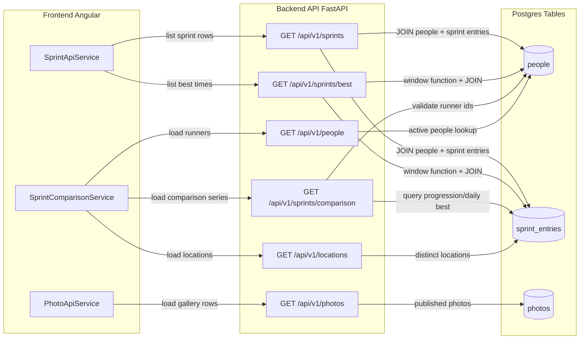
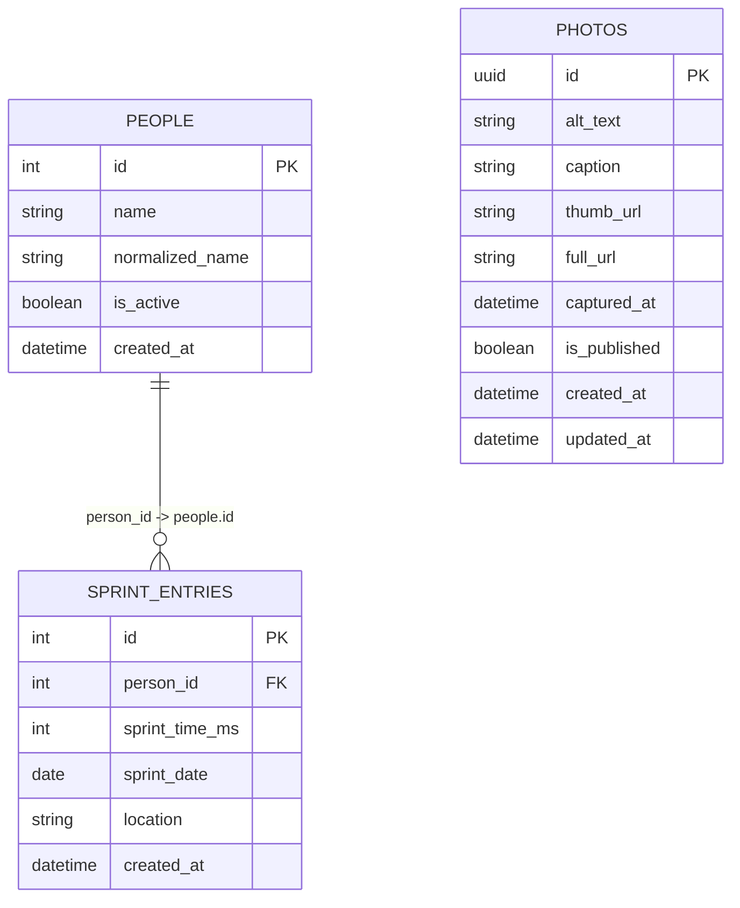

# Database, API, and Frontend Interaction Diagram

This diagram shows how the Angular frontend services call FastAPI routes, and how those routes interact with Postgres tables.

## Notes

- `people` and `sprint_entries` form the sprint domain (one person has many sprint entries).
- `photos` is independent of sprint tables and powers the gallery endpoint.
- The frontend currently reads these resources through dedicated services and does not query the database directly.
